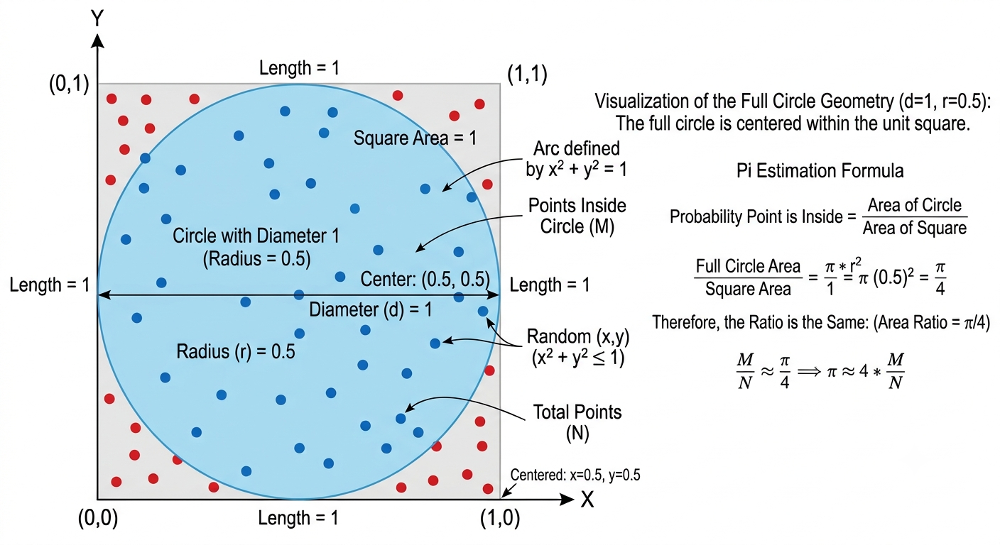

# A Guide to use National Computing Resources
How to access and use National Computing Resources.

# 1. Example: Monte Carlo Pi Estimate

We will run the Monte Carlo Pi Estimation Method on all the computing resources to learn how to use the computing resources. Monte Carlo Pi problem is what computational scientists call "embarrassingly parallel"—meaning the work can be divided into chunks with almost zero communication required between workers until the very end.

Here is how this simple problem lets us demonstrate every major computing paradigm available across national resources:

```
[ TOTAL WORKLOAD: 1,000,000,000 Samples ]
                                         │
        ┌────────────────────────────────┼────────────────────────────────┐
        ▼                                ▼                                ▼
  [ CPU Core 1 ]                   [ CPU Core 2 ]                   [ CPU Core 3 ]
Calculates 333.3M samples        Calculates 333.3M samples        Calculates 333.3M samples
        │                                │                                │
        └────────────────────────────────┼────────────────────────────────┘
                                         ▼
                             [ COMBINE RESULTS AT END ]
                                   M = M1 + M2 + M3
                                  Pi ≈ 4 * (M / N)
```


## 1.1. Monte Carlo Pi Estimation

Monte Carlo Pi Estimation is a statistical method that uses random sampling and probability to approximate the mathematical constant π (3.14159...). By randomly scattering points inside a square that contains an inscribed circle, you can use the ratio of points landing inside the circle to estimate π as shown in figure below. The code to estimate pi is written in python language



```
import random
import sys
import time

def estimate_pi(num_samples):
    """
    Estimates the value of Pi by placing 'total_samples' random points
    in a 1x1 square and checking how many fall inside a unit circle segment.
    """
    inside_circle = 0

    # Loop through the total requested number of random dart throws
    for _ in range(num_samples):
        # Generate random float coordinates (x, y) between 0.0 and 1.0
        x, y = random.random(), random.random()

        # Check if the point falls inside the unit circle using x^2 + y^2 <= 1.0
        if x**2 + y**2 <= 1.0:
            inside_circle += 1

    # Ratio of points inside circle to total points equals Pi / 4
    # Therefore, Pi = 4 * (inside_circle / num_samples)
    pi_estimate = 4.0 * inside_circle / num_samples
    return pi_estimate

if __name__ == "__main__":
    # Check if a sample count was provided as a command-line argument
    # Example: python3 monte_carlo_pi.py 50000000
    if len(sys.argv) > 1:
        # Convert the command line string argument into an integer
        samples = int(sys.argv[1])
    else:
        # Default value if no argument is supplied (10 Million samples)
        samples = 10000000

    print(f"--> Starting Monte Carlo Pi calculation with {samples:,} samples...")

    # Record start time for performance tracking
    start_time = time.time()

    # Run estimate_pi function
    estimated_pi = estimate_pi(samples)
    
    # Record end time
    elapsed_time = time.time() - start_time

    # Output execution results to stdout (standard output)
    print("--------------------------------------------------")
    print(f"Calculated Pi Estimate : {estimated_pi:.6f}")
    print(f"Actual Value of Pi     : 3.141593")
    print(f"Execution Time         : {elapsed_time:.3f} seconds")
    print("--------------------------------------------------")
```
